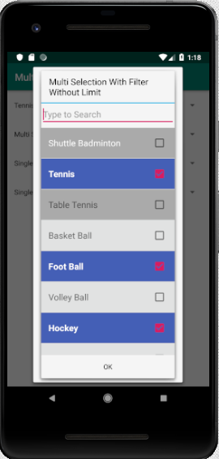

# Android MultiSelect spinner with search

## How to import:
### Add it in your root build.gradle in project lavel at the end of repositories:

	allprojects {
		repositories {
			...
			maven { url 'https://jitpack.io' }
		}
	}

### Add dependency in build.gradle at app lavel:

    implementation 'com.github.pratikbutani:MultiSelectSpinner:08d324c98
    
    
See full doucmentation [github multi search](https://github.com/pratikbutani/MultiSelectSpinner)
